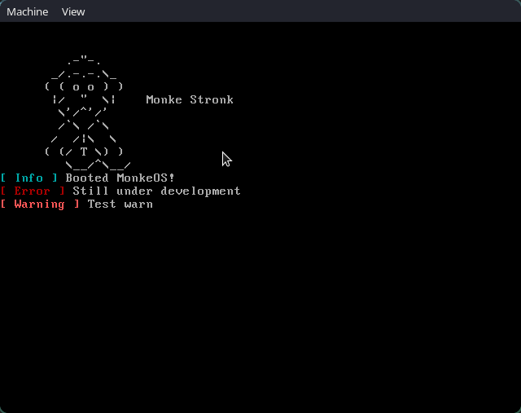
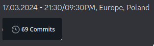

#  MonkeOS 


## an attempt to create OS in C++ and ASM 
## (Make pr) (im dumb) (help)




# Build:
## Install packages:
* Pacman (Arch Linux, Manjaro, itp.):
```
sudo pacman -S gcc g++ qemu
```
* APT (Debian, Ubuntu, itp.):
```
sudo apt install build-essential qemu-system-x86 gcc-multilib
```
* DNF (Fedora, CentOS, itp.):
```
sudo dnf install gcc gcc-c++ qemu-system-x86
```
## Clone repo:
```
git clone https://github.com/riviox/MonkeOS.git
cd MonkeOS
```
## Run `monke.sh`
```
chmod +x monke.sh
./monke.sh build
```
## Start OS in QEMU:
```
./monke.sh run
```

## To Do:
- [x] Debug
- [ ] Keyboard input
- [ ] Shell
- [ ] Commands
